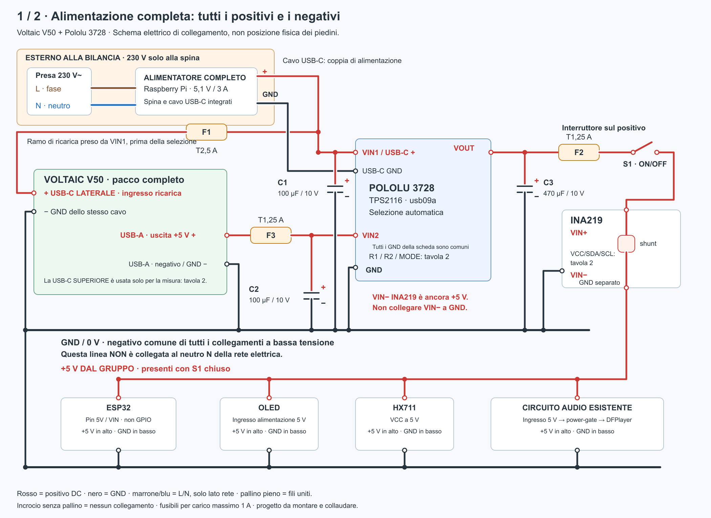
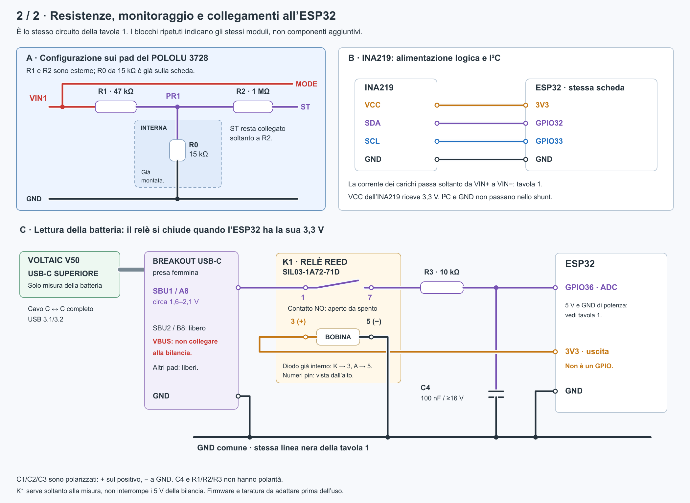

# Alimentazione V50: alternativa non adottata

Riferimento tecnico per una configurazione alternativa **non installata**. L'alimentazione montata usa batteria USB-C NASTIMA e Mini360 MP1482DS regolato a 5,11 V: vedere [cablaggio corrente](../docs/WIRING.md) e [dettagli Mini360](mini360/README.md). La verifica documentale e commerciale di questo studio risale all'11 settembre 2026; prezzi e disponibilità non sono aggiornati. V50 e Pololu non sono stati montati o collaudati sulla bilancia.

Lo schema completo è diviso in due tavole, con tutti i collegamenti positivi e negativi:

- **Tavola 1 — alimentazione, fusibili e condensatori:** [SVG ingrandibile](./schema-alimentazione-v50.svg) · [PNG](./schema-alimentazione-v50.png).
- **Tavola 2 — configurazione Pololu, INA219 e monitoraggio SBU:** [SVG ingrandibile](./schema-monitoraggio-v50.svg) · [PNG](./schema-monitoraggio-v50.png).

Fase **L** e neutro **N** sono rappresentati soltanto all'ingresso dell'alimentatore esterno completo: si usa la sua spina integrata, senza cablare la rete nella bilancia. Il circuito interno usa **positivo DC e GND/0 V**; GND non va collegato al neutro. I disegni sono schemi elettrici, non riproduzioni della posizione fisica dei pin. I blocchi ripetuti nelle due tavole indicano gli stessi componenti.

## Architettura dell'alternativa

**Voltaic V50 completo + Pololu 3728 TPS2116 + alimentatore esterno Raspberry Pi USB-C 5,1 V / 3 A.** La batteria rimane interna. Il caricatore, le protezioni delle celle e il convertitore a 5 V sono già dentro il V50. Il piccolo Pololu seleziona la sorgente e dà precedenza alla rete.

Il punto risolutivo è il percorso **alimentatore → selettore → bilancia**, indipendente dalla batteria. Con V50 esaurito, la bilancia parte dall'alimentatore senza aspettare che il powerbank riattivi la propria uscita. Contemporaneamente, un ramo separato ricarica il V50.

Questa alternativa non usa CTK3S/PWM, TP5100, BMS 2S, celle sfuse o buck esterno. Non descrive il cablaggio montato e non introduce modifiche al firmware corrente.

## Componenti e acquisto

| Elemento | Acquisto verificato | Prezzo esposto / disponibilità |
|---|---|---|
| **Voltaic V50, versione nuova in alluminio con USB-C laterale e SBU** | [SeeSense EU](https://seesense.eu/products/power/batteries/v50-47wh-lithium-battery-with-always-on-capability/) | **98,40 € IVA 23% inclusa**, 80 € netti; disponibile, acquisto diretto. IVA/delivery finali al checkout. |
| **Pololu 3728, TPS2116 USB priority, usb09a** | [Kamami, Polonia](https://kamami.pl/en/power-modules-for-breadboards/1203001-tps2116-power-multiplexer-carrier-with-usb-type-c-connector-usb-priority-5902186335561.html) | **18,29 PLN IVA inclusa**, 4 pezzi; circa 4–5 €, cambio indicativo. |
| Alternativa per lo stesso Pololu | [Botland.store](https://botland.store/protoboard-connector-board-accessories/28443-usb-type-c-power-connector-with-tps2116-multiplexer-usb09a-pololu-3728.html) | **4,50 € esposti**, disponibile; sito riservato alle aziende. |
| **Alimentatore ufficiale Raspberry Pi USB-C 15 W, spina EU, 5,1 V / 3 A** | [BerryBase](https://www.berrybase.de/en/offizielles-raspberry-pi-usb-c-netzteil-5-1v-3-0a-eu-weiss) | **7,90 €** IVA locale inclusa; oltre 100 pezzi esposti. Specifica primaria [Raspberry Pi](https://www.raspberrypi.com/products/type-c-power-supply/). |
| Monitoraggio | Breakout USB-C con SBU e cavo completo USB 3.1/3.2 | Riutilizzabili se già acquistati; la [Adafruit 4090](https://www.adafruit.com/product/4090) è indicata direttamente da Voltaic. INA219 rimane sul carico a 5 V. |
| Isolamento della misura a dispositivo spento | [Standex SIL03-1A72-71D, DigiKey Italia](https://www.digikey.it/it/products/detail/standex-meder-electronics/SIL03-1A72-71D/3131688) | **4,03 € IVA inclusa**, oltre 7.000 pezzi esposti; attenzione: il solo ordine piccolo aggiunge **25 € di spedizione**. Bobina 3 V, compatibile con 3,3 V, diodo incluso. |
| Cablaggio e componenti piccoli | Fusibili e portafusibili isolati, **tre resistenze, quattro condensatori**, cavetti USB, fissaggi | Budget **10–20 €**; dipende da ciò che è già disponibile. |

**Budget principale: circa 125–145 € prima delle spedizioni**, riutilizzando breakout e cavo di monitoraggio se già disponibili. Non è un preventivo del carrello. Le spedizioni provengono da più negozi: il totale consegnato può superare 170 €, soprattutto ordinando il solo relè da DigiKey. Non ho trovato un'offerta Amazon.it verificata dell'intero insieme; i componenti principali si acquistano direttamente da rivenditori europei. Il relè è ordinabile su DigiKey Italia, senza prova della collocazione fisica dello stock in UE.

[SeeSense](https://seesense.eu/faq/) dichiara normalmente evasione entro 24 ore e DHL Express in Europa; alcuni articoli possono richiedere trasferimenti tra sede UE e UK. Il costo per l'Italia è calcolato al checkout. [Kamami](https://kamami.pl/en/content/6-delivery-and-payment) indica Italia in zona FedEx 1, 3–7 giorni lavorativi e circa 6,70 € + IVA di trasporto. Disponibilità e tempi restano quelli esposti, non prenotati.

### Lista completa per una bilancia, incluso monitoraggio

Quantità di montaggio: non comprendono ricambi. I link ai componenti principali sono nella tabella precedente. I valori dei fusibili si riferiscono al limite di 1 A massimo operativo del carico, ancora da misurare sulla bilancia.

| Quantità | Componente | Specifica / funzione |
|---:|---|---|
| 1 | Voltaic V50 | Versione attuale con USB-C laterale e misura SBU superiore |
| 1 | Pololu 3728 | TPS2116, versione usb09a |
| 1 | Alimentatore Raspberry Pi USB-C | Uscita 5,1 V / 3 A; cavo USB-C già integrato |
| 1 | Resistenza 47 kΩ | 1%, 0,25 W, a reofori; configurazione Pololu |
| 1 | Resistenza 1 MΩ | 1%, 0,25 W, a reofori; isteresi Pololu |
| 1 | Resistenza 10 kΩ | 1%, 0,25 W, a reofori; ingresso GPIO36 |
| 2 | Condensatori elettrolitici 100 µF | Almeno 10 V, radiali; ingressi VIN1 e VIN2 |
| 1 | Condensatore elettrolitico 470 µF | Almeno 10 V, radiale; VOUT |
| 1 | Condensatore ceramico 100 nF | Almeno 16 V, a reofori; GPIO36 verso GND |
| 1 | Fusibile T2,5 A | F1, ritardato, formato 5 × 20 mm, rating DC adeguato |
| 2 | Fusibili T1,25 A | F2/F3, ritardati, formato 5 × 20 mm, rating DC adeguato |
| 3 | Portafusibili in linea | Isolati, per 5 × 20 mm, adatti alla corrente del ramo; riutilizzare quelli già idonei |
| 1 | Relè reed Standex SIL03-1A72-71D | Isolamento della misura; bobina nominale 3 V, diodo integrato |
| 1 | Breakout USB-C femmina | Deve esporre **SBU1/A8, SBU2/B8 e GND**, per esempio Adafruit 4090 |
| 1 | Cavo USB-C maschio → USB-C maschio | Corto, completo USB 3.1/3.2, con continuità SBU; non basta un cavo di sola ricarica |
| 1 | Cavetto USB-A maschio → fili liberi | Per uscita V50 verso F3/VIN2; cavo di potenza corto adeguato ad almeno 1 A |
| Quanto basta | Filo flessibile rosso/nero | Almeno 0,5 mm² per il cablaggio di potenza aggiunto |
| Quanto basta | Filo sottile per segnali | Per resistenze, relè, SBU, GPIO36 e GND della misura |
| Un assortimento | Guaina termorestringente e fissaggi isolanti | Isolamento delle giunte, fissaggio schede/relè, fermacavi e scarico di trazione |

**Già presenti o inclusi:** INA219 e interruttore della bilancia, se adeguati; cavo USB-A → USB-C di ricarica incluso con il V50, da adattare mantenendo la spina USB-C. Il breakout e il cavo di misura vanno acquistati solo se non sono già disponibili nella versione adatta: i link discussi in conversazione non costituiscono conferma dell'acquisto.

**Non occorrono in questo schema:** TP5100, BMS 2S separato, celle Samsung sfuse, buck esterno e diodi 1N5822. Le saldature dirette ai pad del Pololu non richiedono strip di pin; i collegamenti vanno isolati e fissati. Stagno, saldatore e multimetro sono attrezzatura di montaggio, non componenti del circuito. L'eventuale prolunga USB-C da pannello dipende dal fissaggio della presa al vano e non è indispensabile elettricamente.

## Collegamenti di potenza

La tavola 1 mostra **entrambi i conduttori** di ogni collegamento di alimentazione: positivo in rosso e GND in nero. La tavola 2 completa tutti i collegamenti del circuito di misura e della configurazione del selettore. Un pallino pieno indica una giunzione; un incrocio senza pallino non unisce i fili.





**VIN− dell'INA219 è il positivo a valle dello shunt, non il negativo dell'alimentazione.** La sua massa si collega al pin GND separato. I condensatori C1/C2/C3 hanno il positivo sulla rispettiva linea VIN1/VIN2/VOUT e il negativo a GND. Il ramo audio mantiene il circuito esistente con power-gate; GPIO2 non alimenta il DFPlayer.

Il prelievo per ricaricare il V50 viene da **VIN1**, prima della selezione. Non collegarlo a VOUT: a spina scollegata si creerebbe un percorso dal powerbank al proprio ingresso.

| Da | A |
|---|---|
| Alimentatore USB-C | Presa USB-C del Pololu 3728 |
| Pololu VIN1 | F1 → positivo del cavetto di ricarica del V50 |
| Negativo dello stesso cavetto | GND Pololu |
| Spina del cavetto di ricarica | **USB-C laterale** del V50 |
| USB-A V50, positivo 5 V | F3 → VIN2 Pololu |
| USB-A V50, negativo | GND Pololu |
| VOUT Pololu | F2 → interruttore → VIN+ INA219; VIN− INA219 → distribuzione 5 V della bilancia |
| GND Pololu | GND ESP32 e di tutte le periferiche |

Per il ramo di ricarica usare il **cavo USB-A → USB-C incluso nel V50**: eliminare la spina USB-A, mantenendo integra quella USB-C. Identificare con il tester positivo e negativo da collegare a F1 e GND, isolando separatamente gli altri conduttori; non basarsi soltanto sul colore. In questo modo si conserva la terminazione della spina USB-C prevista dal fabbricante. Il cavo di uscita è un altro cavetto, con USB-A maschio nel V50 e fili di potenza verso F3/VIN2 e GND. La spina USB-A nel V50 rimane inserita per l'Always On; la USB-C superiore non deve ricevere alimentazione. [Guida Voltaic](https://blog.voltaicsystems.com/updated-usb-c-pd-and-always-on-for-v25-v50-v75-batteries/)

**Fusibili proposti per la prima unità:** F1 T2,5 A sul ramo di ricarica; F2 T1,25 A sul ramo della bilancia; F3 T1,25 A vicino al cavetto USB-A del V50. Usare fusibili con rating DC adatto, portafusibili completamente isolati e fili di potenza almeno 0,5 mm², corti. Questi valori presuppongono bilancia entro **1 A massimo operativo**, inclusi audio e Wi-Fi; una misura superiore richiede ridimensionamento del ramo e dell'alimentatore. I fusibili proteggono il cablaggio; non sostituiscono le protezioni elettroniche del pacco. Non aprire il V50 per aggiungere un fusibile interno.

Il circuito funziona con un normale interruttore sul positivo del carico: spegnendo la bilancia, il V50 può continuare a caricarsi. Per collegare il PC alla USB dell'ESP32 per programmazione, portare prima questo interruttore su OFF, così il PC non viene unito direttamente alla sorgente a 5 V del selettore.

## Configurazione del Pololu

Il nome «USB priority» identifica la versione con USB collegata a VIN1: **la priorità va comunque impostata**.

- Ponticello **MODE → VIN1**.
- **47 kΩ, 1%** tra VIN1 e PR1.
- **1 MΩ, 1%** tra PR1 e ST per l'isteresi. ST non viene collegato all'ESP32 in questa proposta.
- **100 µF / 10 V elettrolitico** tra VIN1 e GND e un altro tra VIN2 e GND, vicini alla scheda.
- **470 µF / 10 V** tra VOUT e GND vicino alla scheda, prima dell'interruttore. Rispettare la polarità dei condensatori.

Schema delle resistenze:

```text
VIN1 -------- MODE
  |
  +--- 47k --- PR1 --- 1M --- ST
                 |
            15k già presenti
                 |
                GND
```

La soglia nominale è circa 4,13 V, con circa 50 mV d'isteresi; la tolleranza del riferimento impedisce di trattarla come una soglia precisa di protezione dell'ESP32. È la configurazione proposta dal costruttore per priorità 5 V. I condensatori limitano transitori e cadute nel passaggio tra sorgenti: non compensano un alimentatore insufficiente. Il primo collaudo deve controllare la continuità anche durante accensione e audio. [Pololu 3728](https://www.pololu.com/product/3728), [datasheet TI TPS2116](https://www.ti.com/lit/ds/symlink/tps2116.pdf)

## Batteria, autonomia e tempi

Il V50 attuale contiene circa **48 Wh**; misura **118 × 82 × 24 mm**, esclusi spine e curve dei cavi. È più largo e lungo della tipica SLA piccola, ma molto più sottile: serve un'impronta libera reale, non basta confrontare i volumi. Il Pololu misura circa 25,4 × 14 × 4,6 mm. [Voltaic](https://voltaicsystems.com/v50/), [dimensioni Pololu](https://www.pololu.com/product/3728/specs)

Stima progettuale: 48 Wh × rendimento ipotizzato 85% × riserva 80% ≈ **32,6 Wh utilizzabili nel calcolo prudenziale**. Il rendimento non è stato misurato sulla bilancia e la riserva non è un dato del fabbricante.

| Consumo medio complessivo a 5 V | Autonomia calcolata con quella riserva |
|---|---:|
| 300 mA / 1,5 W | 21,7 ore |
| 500 mA / 2,5 W | 13,0 ore |
| 800 mA / 4 W | 8,2 ore |
| 1 A / 5 W | 6,5 ore |

**Le otto ore sono dimensionate fino a circa 0,8 A medi, non ancora dimostrate sul dispositivo.** Il requisito separato per l'alimentatore scelto è: ricarica V50 fino a 2 A più bilancia fino a 1 A, senza ulteriori carichi USB. La corrente di picco conta per l'alimentatore; la media conta per l'autonomia.

Il manuale indica **5 ore per il V50 da USB 5 V**. Per pianificare il lavoro considero **6–8 ore disponibili per la ricarica**, da verificare nel vano reale. La priorità all'alimentatore evita di sottrarre alla batteria la corrente del carico durante la ricarica. Non usare la porta PD superiore per velocizzare: farebbe perdere il comportamento Always On richiesto. [Manuale Voltaic 2025](https://voltaicsystems.com/content/batteries/V25_50_75_Instructions_2025.pdf)

A bilancia spenta il V50 in Always On consuma comunque circa **26 mW** dichiarati: sono circa **0,62 Wh al giorno**, a cui si aggiunge il piccolo consumo del selettore. È un assorbimento residuo esplicito, non uno spegnimento totale. [Voltaic](https://voltaicsystems.com/v50/)

Il V25 è l'opzione più economica della stessa famiglia: dimezza circa l'energia, quindi otto ore con la stessa riserva richiedono circa **0,4 A medi o meno**. Non lo scelgo come base finché non conosciamo l'assorbimento: il V50 offre il margine richiesto.

## Monitoraggio senza aprire il powerbank

Il produttore rende accessibile circa metà della tensione delle celle su SBU A8/B8 della USB-C superiore: indicativamente 1,6–2,1 V. Serve un breakout che esponga SBU e, se usato, un cavo completo USB 3.1/3.2. Il connettore superiore viene usato soltanto per la misura: VBUS, D+/D− e gli altri contatti non vanno collegati alla bilancia. [Istruzioni del produttore](https://blog.voltaicsystems.com/updated-usb-c-pd-and-always-on-for-v25-v50-v75-batteries/)

**Misura con GPIO36, disponibile nel pinout attuale:** un piccolo relè reed collega SBU all'ingresso analogico soltanto quando la 3,3 V dell'ESP32 è presente. Così la misura viene scollegata anche quando il V50 esaurito spegne la propria uscita; non serve un GPIO di comando. Il relè non commuta la potenza della bilancia.

Componente esatto: **Standex SIL03-1A72-71D**. Ha quattro piedini, numerati **1, 3, 5, 7**, non 1, 2, 3, 4. Riferirsi alla marcatura del pin 1 e alla vista dall'alto del [datasheet primario, pagina 3](https://standexdetect.com/wp-content/uploads/sites/2/2025/10/flyer-reed-relay-series-sil-high-density.pdf).

| Collegamento del monitor | Destinazione |
|---|---|
| SBU1/A8 del breakout superiore V50 | Pin 1 del relè; SBU2/B8 può rimanere libero |
| Pin 7 del relè | Resistenza **10 kΩ** → GPIO36 ESP32 |
| GPIO36 ESP32 | Condensatore **100 nF** → GND |
| Pin 3 del relè, bobina positiva | **3V3 dell'ESP32**, non un GPIO |
| Pin 5 del relè, bobina negativa | GND comune |
| GND del breakout USB-C | GND comune |

Il modello 71D incorpora già il diodo di protezione della bobina: rispettare 3 positivo / 5 negativo; non serve aggiungere il 1N5822. Consumo calcolato della bobina: circa 6,6 mA a 3,3 V, ossia 22 mW. Montarlo isolato e fissato, con saldature scaricate meccanicamente. Il resistore limita la corrente nei brevi transitori di spegnimento; il contatto aperto elimina il percorso stabile verso ESP32 spento. La capacità sull'ADC aiuta il campionamento. [Linee guida Espressif](https://docs.espressif.com/projects/esp-hardware-design-guidelines/en/latest/esp32/schematic-checklist.html)

**INA219 rimane invece sulla linea del carico:** VIN+ dopo l'interruttore, VIN− verso tutti i carichi a 5 V; VCC alla 3,3 V dell'ESP32, SDA GPIO32, SCL GPIO33, GND comune. Misura assorbimento e tensione dei 5 V, utili a verificare l'autonomia. Non misura la corrente interna di ricarica del Voltaic. Non collegare i suoi morsetti a SBU: il suo assorbimento di ingresso può alterare la misura. [TI INA219](https://www.ti.com/lit/ds/symlink/ina219.pdf)

**La lettura ADC va tarata:** verificare SBU prima di collegarlo, confrontare la lettura con il multimetro a batteria carica e parzialmente scarica, configurare ADC1 per il campo fino a 2,1 V e filtrare i campioni. La relazione iniziale è tensione cella ≈ 2 × tensione SBU; la calibrazione tiene conto del partitore interno e dell'ADC. Non aggiungere un altro partitore a bassa impedenza.

Il risultato è una **percentuale stimata dalla tensione**, non una percentuale digitale certificata dal powerbank. Durante la ricarica la tensione risente del caricatore: non promette la precisione di un contatore di coulomb. Il firmware attuale per la NASTIMA LiFePO4 2S deve essere adattato: percentuale e soglie dalla nuova lettura ADC; INA219 usato per i 5 V e il consumo, non con le vecchie soglie SLA. La ricarica e la protezione del V50 restano autonome dal firmware.

## Cosa succede nell'uso

| Situazione | Alimentazione della bilancia |
|---|---|
| Spina presente, batteria scarica o V50 scollegato | Direttamente dall'alimentatore attraverso VIN1 |
| Spina presente, batteria in carica | Dall'alimentatore; il V50 riceve energia sul proprio ingresso separato |
| Spina assente, V50 con energia e uscita attiva | Da USB-A V50 attraverso VIN2 |
| Spina assente, V50 esaurito | Spegnimento; collegando la spina il carico può ripartire anche prima del recupero del V50 |
| Interruttore bilancia OFF | Carico spento, ricarica ancora disponibile |
| Distacco spina appena collegata a V50 completamente vuoto | L'autonomia dipende dall'energia effettivamente recuperata: il ramo diretto non crea energia nella batteria |

## Vano chiuso e verifica della prima unità

La proposta mantiene il vano chiuso, senza aggiungere fori. Fissare il powerbank senza aprirlo, comprimere l'involucro o avvolgerlo in schiuma isolante; bloccare i connettori contro movimenti, fissare le piccole schede con supporti isolanti e prevedere scarico di trazione dei cavi. Lasciare separazione dall'elettronica che scalda. L'involucro del V50 non rende impermeabile l'insieme dei connettori.

Voltaic dichiara protezioni termiche, contro cortocircuito e sovra/sottocarica, e riporta IEC62133 e UN38.3 per il prodotto. Questo non è un certificato della bilancia modificata. Il manuale ammette ricarica tra 0 e 45 °C e avverte che, se il vano si surriscalda, occorre migliorare il raffreddamento. Non deduco che 30 °C ambiente garantiscano automaticamente temperatura interna accettabile. [Prodotto](https://voltaicsystems.com/v50/), [manuale](https://voltaicsystems.com/content/batteries/V25_50_75_Instructions_2025.pdf)

Il collaudo concreto richiesto è limitato a quattro risultati:

1. **Potenza:** misurare media e picchi a 5 V con OLED, Wi-Fi e audio; massimo entro 1 A per questa distinta.
2. **Continuità:** provare inserimento/rimozione della spina con batteria carica, quasi scarica e uscita V50 disattivata; verificare avvio e assenza di reset nei passaggi con energia disponibile. Controllare con oscilloscopio la linea 5 V e gli ingressi del selettore per cadute e picchi.
3. **Temperatura e durata:** un ciclo completo di carica nel vano chiuso a 30 °C e una giornata di scarica con il carico reale. Rispettare i limiti del pacco; una ricarica che interviene continuamente sulla protezione termica non supera il collaudo. Se necessario trasferire calore passivamente alla struttura, senza introdurre aperture per lo sporco, e ripetere la prova.
4. **Indicatore:** verificare la taratura SBU/ADC36, l'apertura del contatto di misura a bilancia spenta e a batteria esaurita, e le nuove soglie del firmware.

## Perché questa scelta rispetto alle altre

| Alternativa esaminata | Motivo per cui non è la proposta principale |
|---|---|
| Piombo + SECO-LARM ST-2406 | Carica a 100 mA incompatibile con il recupero quotidiano richiesto. |
| Piombo + Alpha BA80622 | Tampone 800 mA, ma limite ambiente 30 °C, tolleranza uscita 5% e avvio sotto carico meno documentato. [Alpha](https://www.alphaelettronica.com/ba80622.html) |
| Piombo + Victron 6/12 V 1,1 A | Buona documentazione e protezioni, ma il test iniziale può rifiutare una batteria molto scarica con carico. Per l'indipendenza richiesta servirebbe comunque un percorso separato. [Manuale Victron](https://www.victronenergy.com/upload/documents/Blue_Smart_IP65_Charger_6V_12V/43498-Blue_Smart_IP65_Charger_6V_12V-pdf-it.pdf) |
| PiSugar 3 Plus | Indicazioni del produttore contrarie alla ricarica in contenitori chiusi. [PiSugar](https://docs.pisugar.com/docs/product-wiki/battery/safety-precautions) |
| PiJuice Zero + Jauch protetta con NTC | Realizzabile, ma circa 18,5 Wh, profilo da configurare e integrazione I²C più articolata. Costo consegnato non inferiore in modo decisivo. |
| Waveshare UPS HAT(D) | Lo schema esaminato usa un partitore fisso sul TS del caricatore; non offre la misura della temperatura delle celle che cercavamo. |
| NASTIMA USB-C | Forma interessante; mancano riscontri del produttore sufficienti sul comportamento durante carica e sul recupero dell'uscita dopo scarica. |
| V50 + soli diodi ideali LM66200 | Avvio da rete risolto, ma viene scelta la tensione maggiore. Il TPS2116 configurato assegna esplicitamente priorità all'alimentatore. |

## Stato della verifica

**Chiusi documentalmente:** scelta dei componenti principali, acquisto UE, ricarica separata dal carico, percorso di avvio indipendente, selezione automatica, dimensionamento energetico e cablaggio proposto.

**Da verificare sull'esemplare:** ingombro con spine, potenza di picco, transitori, temperatura a vano chiuso, otto ore reali e taratura della lettura SBU. Non sono state eseguite prove fisiche, acquisti, modifiche al firmware o contatti con fornitori.
